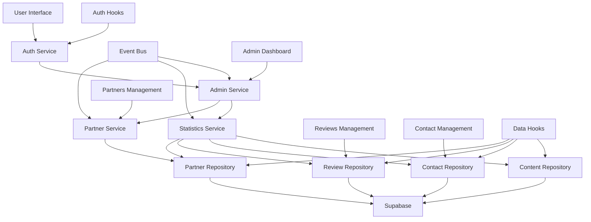

# 🤖 Agent Guide – Projet Prestamazing Management

## 1. Dev Environment Tips
> ℹ️ Comment configurer et lancer l'environnement local  
- Installer les dépendances : `npm install`  
- Lancer le serveur de développement : `npm run dev`  
- Vérifier le lint : `npm run lint` ou utiliser les scripts `./lint-check.sh`  
- Formater le code : `npm run format` ou `./format-code.sh`  
- Analyse qualité complète : `./code-quality.sh`  
- Variables d'environnement : Copier `.env.example` vers `.env` et configurer Supabase

## 2. Testing Instructions
> ⚠️ Les modifications doivent passer tous les tests et le lint  
- Configuration : Vitest avec jsdom pour React  
- Lancer les tests : `npm run test`  
- Tests avec couverture : `npm run test:coverage`  
- Tests en mode watch : `npm run test:watch`  
- Interface graphique : `npm run test:ui`  
- Analyser la couverture : `node scripts/analyze-coverage.js`  
- Seuils de couverture : 70% (branches, fonctions, lignes, statements)  
- Tests spécifiques : `vitest -t "<test name>"`  

## 3. Pull Request (PR) Instructions
- **Titre** : `[Service/Component] <Résumé concis>`  
  - Exemples : `[AuthService] Ajout validation 2FA`, `[AdminDashboard] Optimisation performances`
- **Description** :  
  1. Contexte et objectif en français
  2. Étapes pour tester localement
  3. Impact éventuel sur les autres services/composants
  4. Captures d'écran si changements UI
  5. Résultats des tests : `npm run test` et `npm run lint`
- Inclure des traces d'exécution ou extraits d'erreurs si besoin
- Vérifier que tous les tests passent avant ouverture

## 4. Codex/ChatGPT/Claude/Lovable Usage Tips
> 🛠️ Conseils pour guider l'IA dans ce repo  
- **Architecture** : Repo React/TypeScript avec Supabase backend
- **Patterns principaux** :
  - Services dans `src/services/` (logique métier)
  - Repositories dans `src/repositories/` (accès données)
  - Hooks custom dans `src/hooks/` (état et logique React)
  - Components organisés par domaine dans `src/components/`
- **Recherche ciblée** : Limiter à `src/services/`, `src/repositories/`, `src/hooks/`, `src/components/Admin/`
- **Débogage** : Fournir stack traces complètes et logs console
- **Diagrammes** : Demander un schéma Mermaid avant implémentation complexe
- **Refactoring** : Toujours décomposer en étapes (tests d'abord, puis implémentation)

## 5. Vue d'ensemble des agents/services

| Service/Agent           | Rôle principal                              | Fichier                               | Entrées                   | Sorties                          |
|-------------------------|---------------------------------------------|---------------------------------------|---------------------------|----------------------------------|
| `AuthService`           | Authentification et autorisation            | `src/services/AuthService.ts`         | Credentials, tokens       | User session, permissions        |
| `AdminService`          | Gestion administration                      | `src/services/AdminService.ts`        | Admin operations          | Admin data, validation           |
| `PartnerService`        | Gestion des partenaires                     | `src/services/PartnerService.ts`      | Partner data, logos       | Partner entities, validation     |
| `StatisticsService`     | Calcul et agrégation statistiques          | `src/services/StatisticsService.ts`   | Raw data                  | Stats aggregated                 |
| `EventBus`             | Communication inter-services                | `src/services/EventBus.ts`           | Events, listeners         | Event propagation                |
| `ContactRepository`     | Accès données contacts                      | `src/repositories/SupabaseContactRepository.ts` | Contact queries | Contact entities       |
| `ReviewRepository`      | Gestion avis clients                        | `src/repositories/SupabaseReviewRepository.ts` | Review operations | Review entities        |
| `PartnerRepository`     | Persistance partenaires                     | `src/repositories/SupabasePartnerRepository.ts` | Partner CRUD | Partner persistence    |
| `ContentRepository`     | Gestion contenu dynamique                   | `src/repositories/SupabaseContentRepository.ts` | Content operations | Content entities |

## 6. Détails par agent

### `AuthService`
- **Rôle** : Gestion complète de l'authentification et des permissions
- **Entrées** : Email/password, tokens, user session
- **Sorties** : User authenticated, permissions, session state
- **Dépendances** : Supabase Auth, `IAuthService` interface
- **Tests** : Authentification, autorisations, gestion erreurs
- **Hooks associés** : `useAuth`, `useAuthState`, `useAuthActions`

### `AdminService`
- **Rôle** : Orchestration des opérations d'administration
- **Entrées** : Admin commands, validation requests
- **Sorties** : Admin operations results, security validations
- **Dépendances** : Repositories, security monitoring
- **Tests** : Validation admin, sécurité, permissions
- **Components** : `AdminDashboard`, `AdminLayout`, `BaseAdminPage`

### `PartnerService`
- **Rôle** : Logique métier des partenaires (validation, upload logos)
- **Entrées** : Partner data, logo files, display orders
- **Sorties** : Validated partners, processed logos, ordered lists
- **Dépendances** : `PartnerRepository`, file validation, Supabase storage
- **Tests** : `src/services/__tests__/PartnerService.test.ts`
- **Components** : `PartnersManagement`, `PartnerForm`, `PartnerLogoUpload`

### `StatisticsService`
- **Rôle** : Calcul et agrégation de statistiques dashboard
- **Entrées** : Raw data from repositories
- **Sorties** : Aggregated stats, admin dashboard data
- **Dépendances** : All repositories for data collection
- **Tests** : `src/services/__tests__/StatisticsService.test.ts`
- **Components** : `AdminDashboard` (consommateur principal)

### `EventBus`
- **Rôle** : Communication événementielle entre services
- **Entrées** : Event subscriptions, event emissions
- **Sorties** : Event propagation, listener notifications
- **Dépendances** : Aucune (service central)
- **Tests** : Event emission, subscription, cleanup
- **Usage** : Cross-service communication, state synchronization

### `ContactRepository`
- **Rôle** : Accès et persistance des informations de contact
- **Entrées** : Contact CRUD operations, search filters
- **Sorties** : Contact entities, validation results
- **Dépendances** : Supabase client, `IContactRepository`
- **Tests** : `src/repositories/__tests__/SupabaseContactRepository.test.ts`
- **Components** : `ContactManagement`, `ContactForm`

### `ReviewRepository`
- **Rôle** : Gestion des avis clients et évaluations
- **Entrées** : Review operations, rating filters, approval states
- **Sorties** : Review entities, aggregated ratings
- **Dépendances** : Supabase client, `IReviewRepository`
- **Tests** : CRUD operations, rating calculations
- **Components** : `ReviewsManagement`, `Testimonials`

## 7. Schéma d'interaction



## 8. Ajouter un nouvel agent/service

1. **Identifier la responsabilité** : Un service = une responsabilité métier
2. **Créer l'interface** : `src/interfaces/INewService.ts`
3. **Implémenter le service** : `src/services/NewService.ts`
4. **Ajouter les tests** : `src/services/__tests__/NewService.test.ts`
5. **Intégrer dans le provider** : `src/providers/ServiceProvider.tsx`
6. **Documenter ici** : Mettre à jour ce fichier `AGENT.md`
7. **Créer les hooks** : `src/hooks/useNewService.ts` si nécessaire

## 9. Meilleures pratiques

* **Single Responsibility** : Un service = une responsabilité métier claire
* **Dependency Injection** : Services injectés via providers React
* **Interface Segregation** : Interfaces TypeScript pour chaque service
* **Error Handling** : Gestion d'erreurs centralisée avec `useErrorHandler`
* **Testing** : Tests unitaires obligatoires, mocks pour dépendances externes
* **Type Safety** : TypeScript strict activé, pas de `any`
* **Performance** : Hooks optimisés avec `useMemo`, `useCallback`

## 10. TODOs & Améliorations

- [ ] Lier `AGENT.md` depuis le `README.md`
- [ ] Générer automatiquement le diagramme Mermaid depuis le code
- [ ] Documenter les événements du EventBus
- [ ] Ajouter monitoring des performances des services
- [ ] Créer des health checks pour chaque service
- [ ] Documenter les schémas de données Supabase
- [ ] Ajouter des métriques de couverture par service
- [ ] Implémenter un système de logs centralisé

## 11. Interfaces détaillées des agents

### IAuthService
```typescript
interface IAuthService {
  signIn(email: string, password: string): Promise<AuthResult>;
  signOut(): Promise<void>;
  getCurrentUser(): User | null;
  checkAdminStatus(): Promise<boolean>;
}
```

### IPartnerService
```typescript
interface IPartnerService {
  validatePartnerData(data: PartnerData): ValidationResult;
  uploadLogo(file: File): Promise<string>;
  reorderPartners(partners: Partner[]): Promise<void>;
}
```

## 12. Protocoles de messages

### EventBus Events
- `partner.created` : Nouveau partenaire ajouté
- `partner.updated` : Partenaire modifié
- `review.approved` : Avis client approuvé
- `contact.updated` : Information contact mise à jour
- `auth.login` : Utilisateur connecté
- `auth.logout` : Utilisateur déconnecté

## 13. Surveillance & Performances

### Métriques clés
- Temps de réponse des services
- Taux d'erreur par repository
- Utilisation mémoire des hooks
- Performance des requêtes Supabase

### Outils de monitoring
- Console.log pour développement
- Error boundaries React
- Supabase Dashboard pour DB monitoring
- Browser DevTools pour performance

## 14. Gestion des erreurs

### Stratégie d'erreurs
- `useErrorHandler` : Hook centralisé pour gestion erreurs
- `useStandardToast` : Notifications utilisateur uniformes
- Error boundaries : Récupération gracieuse des erreurs React
- Validation côté client : Avant envoi API

### Types d'erreurs
- `ValidationError` : Données invalides
- `AuthError` : Problèmes d'authentification
- `NetworkError` : Problèmes de connectivité
- `PermissionError` : Accès non autorisé

## 15. Points d'extension

### Hooks extensibles
- `useGenericForm` : Formulaires réutilisables
- `useDataFetching` : Récupération données optimisée
- `useLoadingSpinner` : États de chargement uniformes

### Patterns d'extension
- Provider pattern pour nouveaux services
- Repository pattern pour nouvelles sources de données
- Event-driven architecture via EventBus

## 16. Considérations de déploiement & sécurité

### Scalabilité
- Services découplés via interfaces
- Repositories cachables
- Hooks optimisés pour re-renders

### Surveillance
- Logs structurés dans services
- Monitoring des performances Supabase
- Alertes sur taux d'erreur élevé

### Validation des entrées
- Validation TypeScript compile-time
- Validation runtime avec Zod
- Sanitisation des inputs utilisateur

### Limites de ressources
- Upload files limitées (2MB pour logos)
- Rate limiting sur APIs Supabase
- Timeout sur requêtes longues

## 17. Documentation

### Sources de documentation
- Ce fichier `AGENT.md` : Guide des agents/services
- `TESTING.md` : Guide complet des tests
- `README.md` : Overview projet et setup
- JSDoc dans le code : Documentation inline
- Tests comme documentation : Exemples d'usage

### Mise à jour documentation
- Synchroniser avec changements code
- Maintenir exemples à jour
- Documenter breaking changes
- Versionner les interfaces publiques
