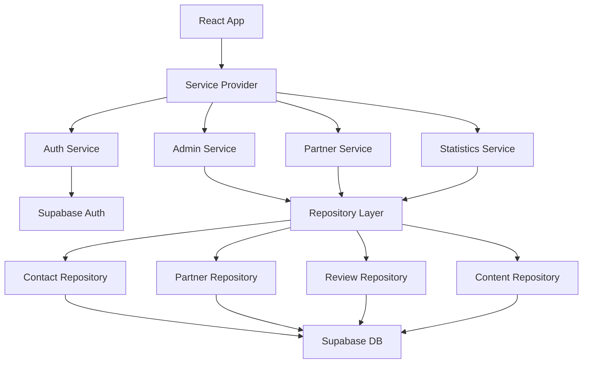

# Prestamazing Management

[](LICENSE)
[](package.json)
[](https://www.typescriptlang.org/)
[](https://reactjs.org/)
[](https://vitejs.dev/)
[](https://supabase.com/)
[](https://vitest.dev/)
[](vitest.config.ts)

## 🚀 Objectif du projet

Prestamazing Management est une plateforme web moderne de gestion d'entreprise de services, intégrant une interface d'administration complète, un système d'authentification sécurisé, et une architecture modulaire basée sur des services et repositories. Le projet utilise React/TypeScript avec Supabase comme backend.

## 🧰 Stack technologique

### Frontend
- **React 18.3+** - Bibliothèque UI avec hooks modernes
- **TypeScript 5.0+** - Typage statique et sécurité
- **Vite** - Build tool et serveur de développement
- **Tailwind CSS** - Framework CSS utilitaire
- **shadcn/ui** - Composants UI modernes
- **React Router 6** - Routage côté client
- **React Hook Form** - Gestion des formulaires
- **Zod** - Validation de schémas
- **TanStack Query** - Gestion d'état serveur

### Backend & Infrastructure
- **Supabase** - BaaS (Auth, Database, Storage)
- **PostgreSQL** - Base de données relationnelle
- **Row Level Security (RLS)** - Sécurité granulaire

### Tests & Qualité
- **Vitest** - Framework de test moderne
- **Testing Library** - Tests de composants React
- **ESLint** - Linting JavaScript/TypeScript
- **Prettier** - Formatage de code

## ⚡ Démarrage rapide

```bash
# Cloner le projet
git clone <votre-repo-url>
cd prestamazing-management

# Installer les dépendances
npm install

# Configurer l'environnement
cp .env.example .env
# Éditer .env avec vos clés Supabase

# Lancer en développement
npm run dev
```

## 🔧 Installation

### Pré-requis système
- **Node.js** ≥ 18.0.0
- **npm** ≥ 8.0.0 (ou pnpm/yarn)
- Compte **Supabase** configuré

### Depuis les sources
```bash
# 1. Cloner le dépôt
git clone <repository-url>
cd prestamazing-management

# 2. Installer les dépendances
npm install

# 3. Configuration Supabase
cp .env.example .env
```

### Mode développement
```bash
# Variables d'environnement requises (.env)
VITE_SUPABASE_URL=your-supabase-url
VITE_SUPABASE_KEY=your-anon-key

# Vérifier la configuration
npm run type-check
```

## ▶️ Lancement

### Après installation
```bash
# Serveur de développement (port 8080)
npm run dev

# Build de production
npm run build

# Prévisualisation du build
npm run preview

# Vérification des types
npm run type-check
```

## 📦 Utilisation

### Interface d'administration
```bash
# Accéder à l'interface admin
http://localhost:8080/admin

# Authentification requise
# - Créer un utilisateur dans Supabase
# - Assigner le rôle 'admin' dans user_roles
```

### Exemple minimal d'utilisation des services
```typescript
import { useServices } from '@/providers/ServiceProvider';

function MyComponent() {
  const { partnerService, authService } = useServices();
  
  // Utilisation des services
  const handleCreatePartner = async (data) => {
    await partnerService.createPartner(data);
  };
}
```

## ⚙️ Utilisation avancée

### 🔌 Injection de dépendances

```typescript
// Services injectés via React Context
import { ServiceProvider } from '@/providers/ServiceProvider';

function App() {
  return (
    <ServiceProvider>
      <YourApp />
    </ServiceProvider>
  );
}
```

Pour plus de détails sur l'architecture des services, consultez [AGENT.md](AGENT.md).

### 📈 Collecte de métriques

```typescript
// Utilisation des hooks de monitoring
import { useAnalyticsData } from '@/hooks/useAnalyticsData';

const { stats, loading } = useAnalyticsData();
```

Voir la documentation complète dans [AGENT.md](AGENT.md) - Section "Surveillance & Performances".

### ❗ Gestion des erreurs

```typescript
// Hook centralisé pour la gestion d'erreurs
import { useErrorHandler } from '@/hooks/useErrorHandler';

const { handleError, handleAsyncError } = useErrorHandler();

// Gestion d'erreur avec toast automatique
handleError(error, { 
  title: "Erreur de création", 
  logContext: "PartnerService" 
});
```

Consultez [AGENT.md](AGENT.md) - Section "Gestion des erreurs" pour plus de détails.

## 🧠 Architecture



Pour une description détaillée des agents internes et de leurs responsabilités, consultez [AGENT.md](AGENT.md).

## 📁 Structure du projet

```
src/
├── components/          # Composants React organisés par domaine
│   ├── Admin/          # Interface d'administration
│   ├── Auth/           # Authentification
│   ├── common/         # Composants réutilisables
│   └── ui/             # Composants shadcn/ui
├── hooks/              # Hooks React personnalisés
├── services/           # Services métier
├── repositories/       # Couche d'accès aux données
├── providers/          # Context providers
├── types/              # Définitions TypeScript
├── pages/              # Pages/Routes
└── test/               # Configuration et utilitaires de test
```

## 🖥️ Compatibilité Windows

```bash
# Utilisation des scripts cross-platform
npm run dev        # Fonctionne sur Windows/Mac/Linux
npm run build      # Build universel
npm run preview    # Prévisualisation cross-platform
```

Le projet est entièrement compatible Windows grâce à Vite et aux outils modernes utilisés.

## 🛠️ Fichiers de configuration

| Fichier | Rôle |
|---------|------|
| `vite.config.ts` | Configuration Vite et Vitest |
| `tailwind.config.ts` | Configuration Tailwind CSS |
| `tsconfig.json` | Configuration TypeScript |
| `eslint.config.js` | Règles de linting |
| `.env.example` | Variables d'environnement modèles |
| `supabase/config.toml` | Configuration Supabase |

## 🧪 Tests

### Installation des dépendances de développement
```bash
# Déjà incluses dans npm install
npm install --include=dev
```

### Exécution de l'ensemble de la suite
```bash
# Tous les tests
npm run test

# Tests en mode watch
npm run test:watch

# Interface graphique
npm run test:ui
```

### Couverture et rapport HTML
```bash
# Tests avec couverture
npm run test:coverage

# Rapport HTML dans coverage/
open coverage/index.html
```

### Exemples de sélections
```bash
# Cibler un test spécifique
npx vitest -t "useAuth should authenticate user"

# Tests d'un composant
npx vitest src/components/Admin

# Analyser la couverture
node scripts/analyze-coverage.js
```

Pour plus de détails, consultez [TESTING.md](TESTING.md).

## 🔍 Qualité du code

### Formatage & import sorting
```bash
# Formatage avec Prettier
npm run format
./format-code.sh

# Vérification du formatage
npx prettier --check "src/**/*.{ts,tsx}"
```

### Typage statique
```bash
# Vérification TypeScript
npm run type-check
./type-check.sh

# Mode strict
npx tsc --noEmit --strict
```

### Linting & hooks
```bash
# Analyse ESLint complète
npm run lint
./lint-check.sh

# Analyse de qualité globale
./code-quality.sh
```

Voir [AGENT.md](AGENT.md) pour les standards de code détaillés.

## 🤝 Contribuer

1. Fork le projet
2. Créer une branche feature (`git checkout -b feature/AmazingFeature`)
3. Commit vos changements (`git commit -m 'Add some AmazingFeature'`)
4. Push vers la branche (`git push origin feature/AmazingFeature`)
5. Ouvrir une Pull Request

Consultez [AGENT.md](AGENT.md) - Section "Pull Request Instructions" pour les conventions.

## 📚 Documentation liée

- **[AGENT.md](AGENT.md)** - Guide complet des agents et services
- **[TESTING.md](TESTING.md)** - Guide des tests et couverture
- **[docs/architecture/](docs/architecture/)** - Documentation architecture
  - [FOLDER_STRUCTURE.md](docs/architecture/FOLDER_STRUCTURE.md)
  - [BEST_PRACTICES.md](docs/architecture/BEST_PRACTICES.md)
  - [FEATURE_TEMPLATE.md](docs/architecture/FEATURE_TEMPLATE.md)

## 🚀 Publication d'une release

```bash
# 1. Mettre à jour la version
npm version patch|minor|major

# 2. Build de production
npm run build

# 3. Tests complets
npm run test:coverage
npm run lint

# 4. Tag et publication
git push origin main --tags
```

## 🛡️ Licence

Ce projet est sous licence MIT. Voir le fichier [LICENSE](LICENSE) pour plus de détails.

---

## 📋 TODOs & Améliorations

- [ ] Ajouter CI/CD GitHub Actions
- [ ] Configurer Codecov pour la couverture
- [ ] Documenter l'API Supabase
- [ ] Ajouter des tests E2E avec Playwright
- [ ] Mettre en place le monitoring des performances
- [ ] Créer un guide de déploiement
- [ ] Ajouter des exemples d'usage avancés

---

**Développé avec ❤️ par l'équipe Prestamazing**
